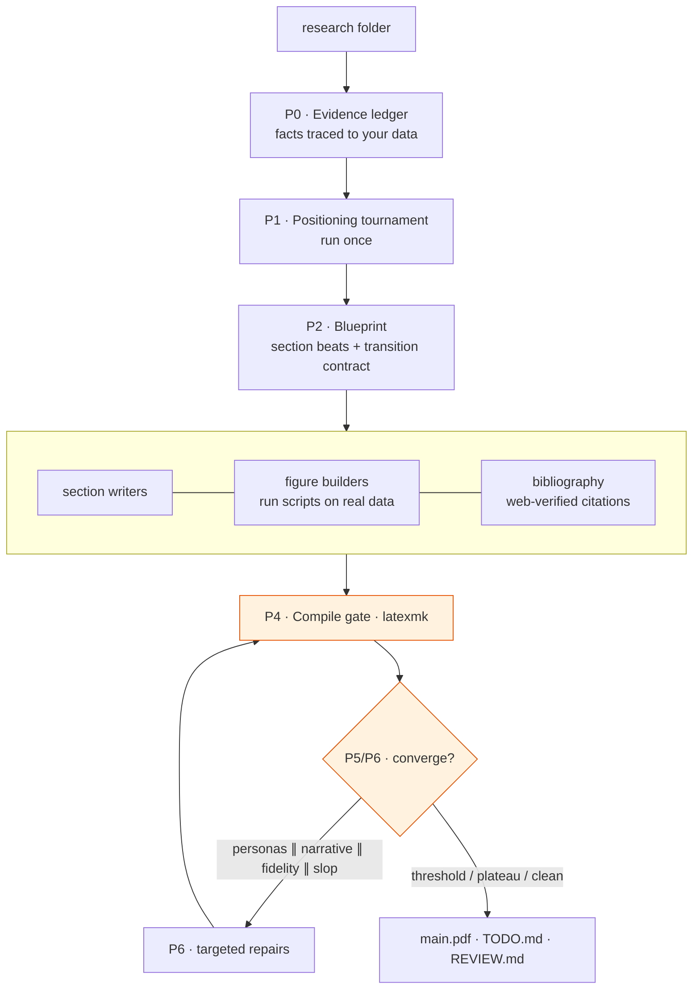

# preprint-af

**Turn a folder of research into a submission-ready scientific paper — built on [AgentField](https://github.com/Agent-Field?utm_source=github&utm_medium=readme&utm_campaign=preprint-af).**


Point `preprint-af` at a folder — raw data, result tables, notebooks, a rough draft, or an
existing paper — and it writes a complete LaTeX paper: an evidence ledger traced to your
numbers, a strategically chosen title and abstract, figures generated by running scripts
against your real data, and prose that reads like a scientist wrote it. It then plays its own
reviewer panel and revises until the paper stops improving. Missing experiments become
`\todobox` items in the PDF and a `TODO.md` you can act on. It never invents a number.

---

## One-Call DX

```bash
curl -sS -X POST http://localhost:8080/api/v1/execute/async/preprint-af.write_paper \
  -H 'Content-Type: application/json' \
  -d '{"input": {"folder_path": "./examples/serve-paper",
                 "target_venue": "high-impact machine learning systems venue",
                 "field_hint": "machine learning systems",
                 "max_rounds": 6}}'
```

```json
{ "execution_id": "exec_...", "status": "queued" }
```

Poll the execution; the result points at the compiled paper and the run workspace:

```json
{
  "status": "succeeded",
  "result": {
    "title": "Why Semantic Caching Fails: Margin, Competition, and Local Density",
    "pdf_path": ".tmp/runs/<id>/paper/main.pdf",
    "positioning_path": ".tmp/runs/<id>/POSITIONING.md",
    "review_path": ".tmp/runs/<id>/REVIEW.md",
    "final_score": 0.66,
    "stop_reason": "quality_plateau",
    "rounds": [ { "round": 2, "total_score": 0.66, "fidelity_score": 0.93, "compile_ok": true } ]
  }
}
```

Everything a run produces lives in a single git-tracked workspace under `.tmp/runs/<id>/`, so
every phase and revision round is a commit you can diff or roll back to.

---

## Dynamic Pipeline Architecture



Seven phases, driven by [AgentField](https://github.com/Agent-Field?utm_source=github&utm_medium=readme&utm_campaign=preprint-af) reasoners for the thinking
and [OpenCode](https://opencode.ai?utm_source=github&utm_medium=readme&utm_campaign=preprint-af) coding agents for every read and write of a real file:

1. **Evidence ledger** — an agent explores your folder (CSVs, notebooks, drafts, PDFs, figure
   scripts) and writes `EVIDENCE.md`: every claimable fact with exact numbers, source paths, and
   how it was derived. Nothing enters the paper unless it traces here.
2. **Positioning tournament** — 5–6 genuinely different framings of the same results (speed vs
   memory vs mechanism vs reliability), each written as a concrete title and mini-abstract, judged
   in parallel by reviewer and editor personas, with a live novelty scan of related work. The
   winner is frozen into `POSITIONING.md`. This runs **once** — the paper's story does not drift.
3. **Blueprint** — section-by-section beats with an explicit *transition contract* (what each
   section must establish for the next), the fact ids each section may use, and a figure plan tied
   to real data files.
4. **Parallel build** — one agent per section file, one per figure (it writes the matplotlib
   script, *runs it* against your data, and verifies the PDF), and one for the bibliography. No
   merge conflicts: each agent owns one file.
5. **Compile gate** — `latexmk` must produce a PDF; failures get a targeted, LaTeX-only repair.
6. **Critique** — reviewer personas read the *whole* paper, a narrative critic checks flow and
   whether the body delivers what the title promises, a fidelity auditor traces every number back
   to the ledger, and a deterministic linter flags AI-slop patterns.
7. **Repair & converge** — findings route into bounded per-section edits, the paper recompiles and
   rescores, and the loop repeats until it converges.

---

## How It Works

### Evidence grounding, not confabulation
Every quantitative claim in the paper must trace to a fact id in `EVIDENCE.md`. The fidelity
auditor runs each round and **fails closed**: fabricated numbers or citation keys that are absent
from `refs.bib` are caught deterministically and block convergence until fixed. Where the data to
support a claim does not exist, the writer emits a `\todobox{...}` and a `TODO.md` entry instead of
inventing a result.

### Positioning as a tournament, decided once
The same results can be told as a speed story, a memory story, a reliability story. `preprint-af`
generates those framings as concrete title/abstract artifacts, has distinct personas score them for
comprehension, credibility, and how natural they read, scans for collisions with existing work, and
picks one governing story before a single section is written — so the whole paper pulls in one
direction.

### Prose that does not read like a machine
A frozen style contract ships in each workspace as `AGENTS.md` (auto-read by every OpenCode agent):
no em dashes, a banned-phrase list, claims-first paragraphs, varied sentence rhythm, minimal
headings. A deterministic linter enforces it — em-dash census, banned lexicon, "not only … but also"
constructions, heading density, uniform-rhythm detection — so slop is caught mechanically before any
model tokens are spent judging it.

### Convergence, not a fixed number of passes
The revision loop stops when the paper is actually done: the quality threshold is met with a clean
compile and no fidelity blockers, or the score plateaus across rounds, or there is nothing left to
repair. `max_rounds` is only a safety cap. Because OpenCode enforces no turn or budget limits, the
loop budget is enforced in Python.

---

## Quick Start

### Host-native (recommended)

The compile gate needs a real LaTeX toolchain, and figure scripts need Python. Running on the host
uses your local TeX Live directly and lets the node read your real paper folders without volume
mounts.

**Prerequisites:** the [`af`](https://github.com/Agent-Field?utm_source=github&utm_medium=readme&utm_campaign=preprint-af) CLI, the [`opencode`](https://opencode.ai?utm_source=github&utm_medium=readme&utm_campaign=preprint-af)
CLI, a LaTeX toolchain (`latexmk` + `pdflatex`, e.g. MacTeX or TeX Live), and an
`OPENROUTER_API_KEY`.

```bash
git clone <this-repo> && cd preprint-af
cp .env.example .env                 # set OPENROUTER_API_KEY
python -m venv .venv && .venv/bin/pip install -r requirements.txt

af server &                          # control plane on :8080
PATH="$HOME/.opencode/bin:$PATH" .venv/bin/python main.py   # node on :8001
```

Confirm the node registered:

```bash
curl -fsS http://localhost:8080/api/v1/discovery/capabilities \
  | jq '.capabilities[] | select(.agent_id=="preprint-af") | .reasoners[].id'
```

Run the bundled example (an existing draft to polish):

```bash
EXEC=$(curl -sS -X POST http://localhost:8080/api/v1/execute/async/preprint-af.write_paper \
  -H 'Content-Type: application/json' -d @examples/payload.json | jq -r '.execution_id')

curl -sS http://localhost:8080/api/v1/executions/$EXEC | jq '{status, result}'
```

### Docker

```bash
cp .env.example .env                 # set OPENROUTER_API_KEY
docker compose up --build
```

The image bundles TeX Live and OpenCode. Mount the folder you want to write about and pass its
in-container path as `folder_path`.

---

## Inputs

`preprint-af.write_paper` accepts:

| field | default | meaning |
|---|---|---|
| `folder_path` | — | Folder with your research: data, results, notebooks, a draft, or a paper. |
| `target_venue` | `null` | Target journal/conference; shapes structure and positioning. |
| `field_hint` | `null` | Field, e.g. `"machine learning systems"`. |
| `max_rounds` | `6` | Safety cap on critique/repair rounds after the first build. |
| `allow_web` | `true` | Allow web lookups for real, verifiable citations and a novelty scan. |
| `dry_run` | `false` | Stop after evidence + positioning + blueprint; write no paper. |
| `quality_threshold` | `0.90` | Score at which the loop may converge. |
| `model` | DeepSeek v4 Pro | Any LiteLLM-style `openrouter/…` model for both reasoning and OpenCode. |

Set `dry_run: true` for a cheap preview of the strategy (the winning title, abstract, and section
plan) before committing to a full write.

---

## Outputs

A run workspace under `.tmp/runs/<id>/`:

```
EVIDENCE.md        fact ledger with provenance
POSITIONING.md     winning frame, title, abstract, rejected alternatives
BLUEPRINT.md       section beats and transition contract
paper/main.pdf     the compiled paper
paper/             main.tex, sections/, figures/ (scripts + rendered PDFs), refs.bib
reviews/round_N/   every persona, narrative, fidelity, and slop report
TODO.md            missing experiments and unresolvable citations
REVIEW.md          honest unresolved problems at stop time
```

---

## Development

`docs/ARCHITECTURE.md` documents the module layout, data models, and the AgentField/OpenCode
behaviors the code depends on.

```bash
.venv/bin/python -m py_compile main.py src/preprint_af/reasoners/*.py
```

---

## About

Built on [AgentField](https://github.com/Agent-Field?utm_source=github&utm_medium=readme&utm_campaign=preprint-af) (reasoner orchestration, workflow provenance)
and [OpenCode](https://opencode.ai?utm_source=github&utm_medium=readme&utm_campaign=preprint-af) (file-editing coding agents). Default model:
`openrouter/deepseek/deepseek-v4-pro`. Apache 2.0.
