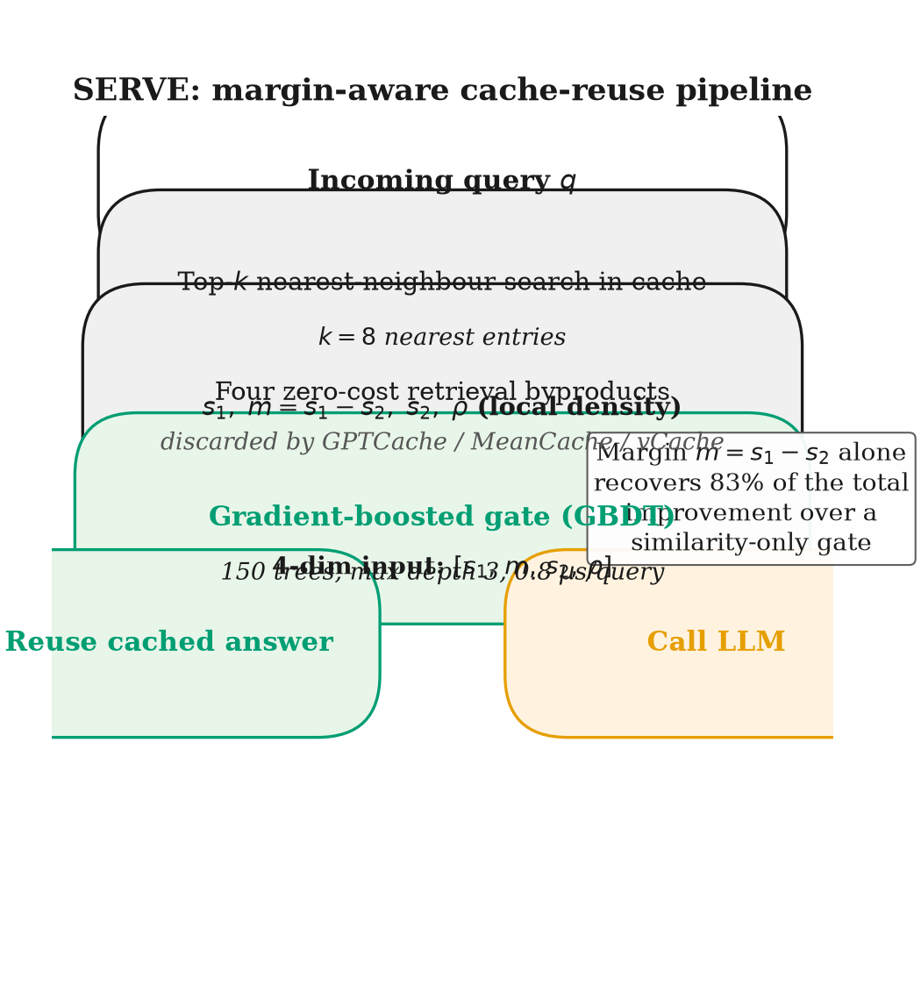

# Example paper: SERVE

A realistic `preprint-af` example based on SERVE. The folder now includes the
source draft inputs plus the latest generated paper output from AgentField run
`run_20260702_160823_tadbh6jo`.

## Latest Output

- PDF: [main.pdf](main.pdf)
- Primary preview: [fig1_mechanism.png](figures/fig1_mechanism.png)
- Additional generated figures: [fig1_sota_ablation.png](figures/fig1_sota_ablation.png), [fig2_frontier.png](figures/fig2_frontier.png), [fig4_grid.png](figures/fig4_grid.png)



```
serve-paper/
├── main.tex           # generated paper entrypoint
├── main.pdf           # generated PDF
├── refs.bib           # generated bibliography
├── sections/          # generated section files
├── figures/           # generated figure scripts plus PDF/PNG outputs
    ├── fig1_sota_ablation.py
    ├── fig2_embedding_quality.py
    ├── fig3_recurrence.py
    ├── fig4_best_regime_grid.py
    ├── fig5_paws.py
    └── ...
├── reviews/           # review bundles emitted by critique rounds
└── run-artifacts/     # evidence, positioning, blueprint, TODO, and state files
```

`preprint-af` copies the requested input folder into a run workspace under
`.tmp/runs/<id>/input/`, builds an evidence ledger from it, then writes a fresh
paper in `.tmp/runs/<id>/paper/`. This checked-in example mirrors the latest
generated paper output so the PDF and figure artifacts are recoverable from the
repo.

Run it with `examples/payload.json`:

```bash
curl -sS -X POST http://localhost:8080/api/v1/execute/async/preprint-af.write_paper \
  -H 'Content-Type: application/json' \
  -d @examples/payload.json | jq -r '.execution_id'
```
